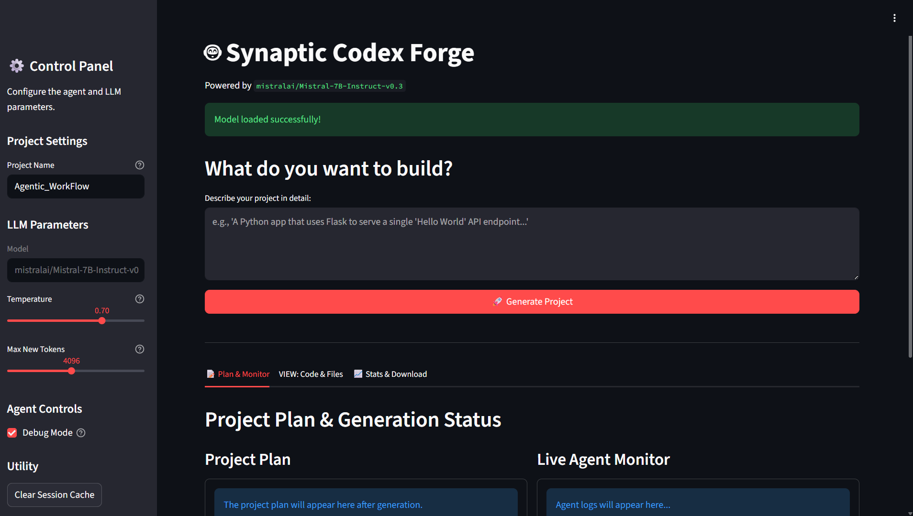
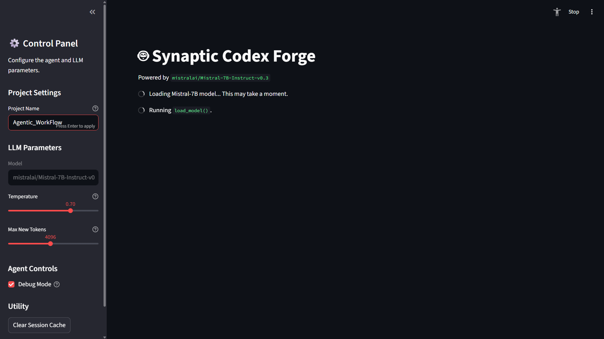
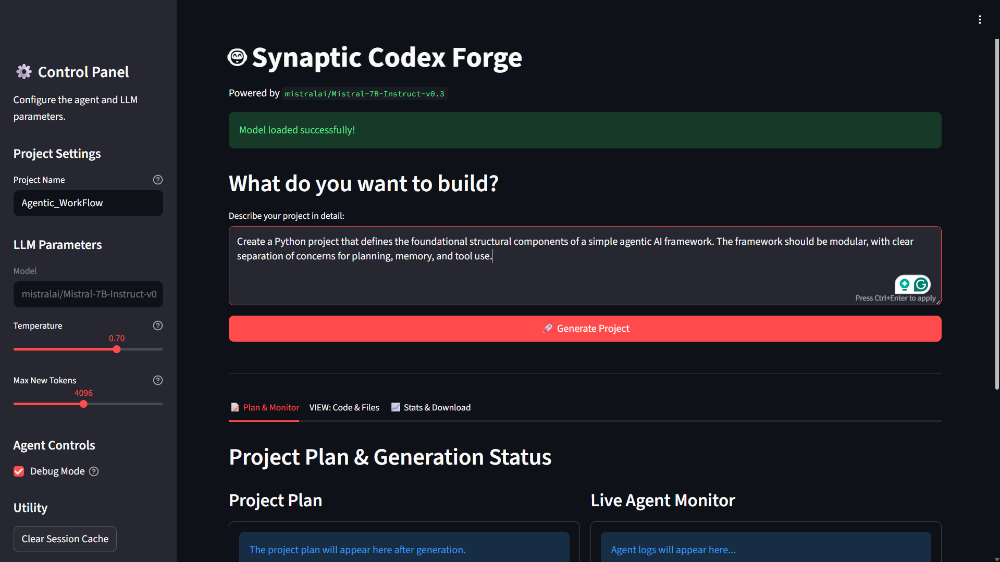
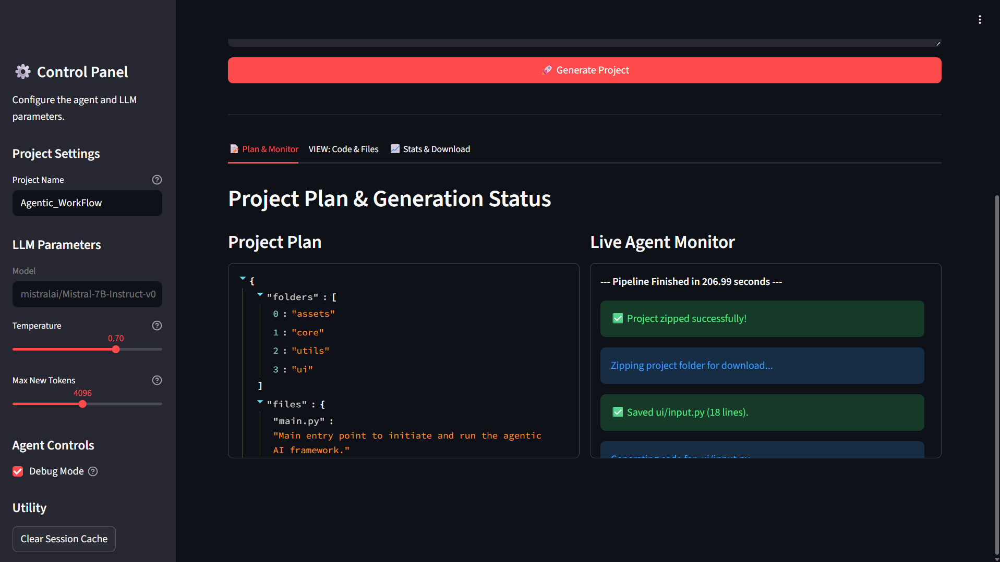
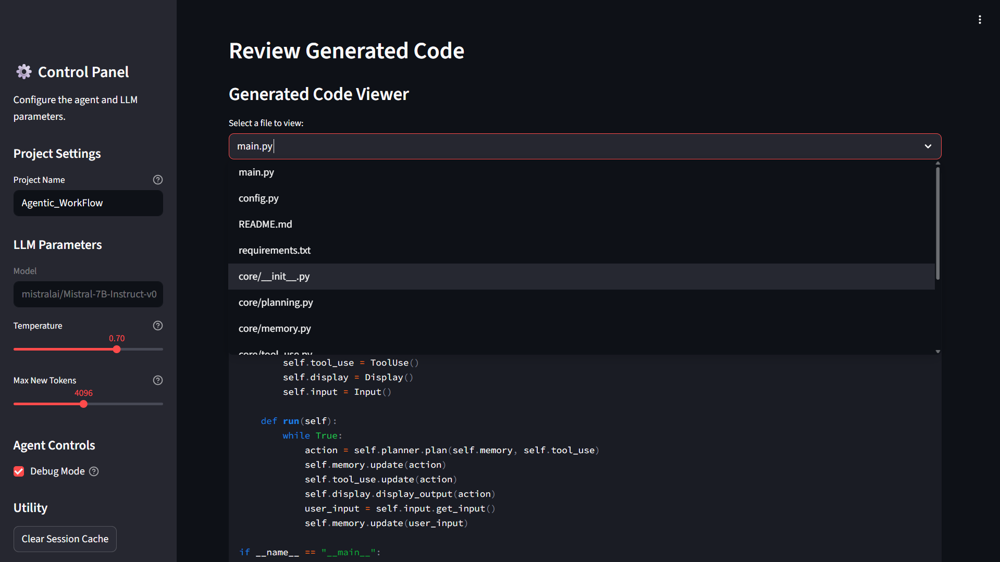
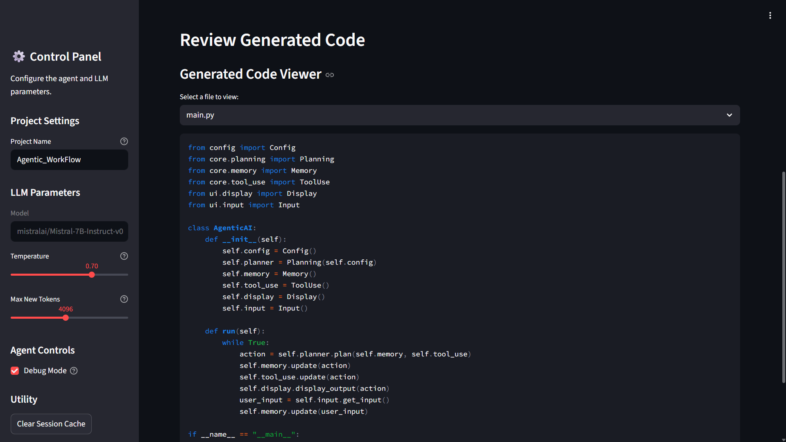
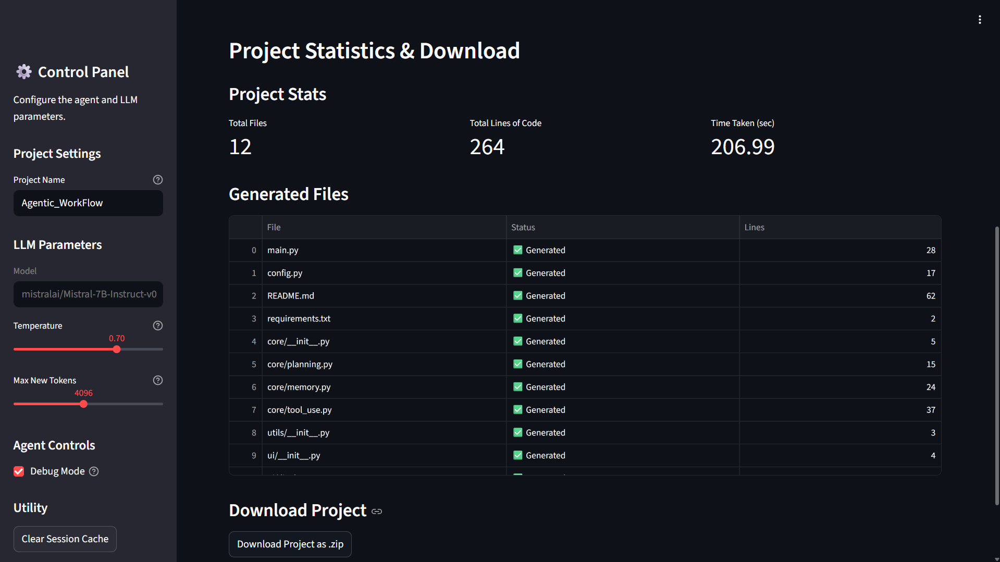
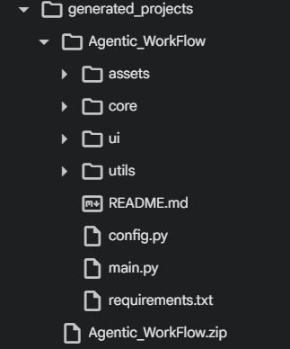
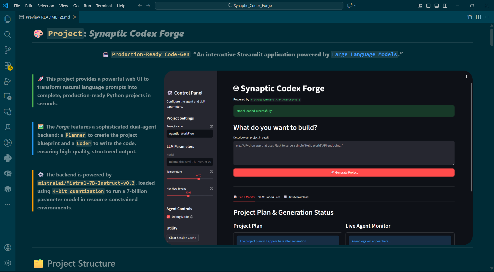

# 🎨 **`Project`: _Synaptic Codex Forge_**
<div align="center">

### 🤖 `Production-Ready Code-Gen`: **“An interactive Streamlit application powered by [`Large Language Models`](https://en.wikipedia.org/wiki/Large_language_model).”** <br>

</div>

<br>


<div style="border-left: 4px solid #4CAF50; padding-left: 12px; margin: 12px 0; font-size: 16px;">
🚀 <b>This project provides a powerful web UI to transform natural language prompts into complete, production-ready Python projects in seconds.</b>
</div>

<br>

<div style="border-left: 4px solid #2196F3; padding-left: 12px; margin: 12px 0; font-size: 16px;">
🖼️ <b>The <i>Forge</i> features a sophisticated dual-agent backend: a <code>Planner</code> to create the project blueprint and a <code>Coder</code> to write the code, ensuring high-quality, structured output.</b>
</div>

<br>

<div style="border-left: 4px solid #FF9800; padding-left: 12px; margin: 12px 0; font-size: 16px;">
⚙️ <b>The backend is powered by <code>mistralai/Mistral-7B-Instruct-v0.3</code>, loaded using <code>4-bit quantization</code> to run a 7-billion parameter model in resource-constrained environments.</b>
</div>

<div style="clear: both;"></div>

---

<br>

<div align="left">

# 🗂️ Project Structure

<br>

</div>

```markdown-tree
📁 Synaptic_Codex_Forge/
├── main.py                         # Application entry point (runs the Streamlit app)
├── config.py                       # Central configuration for models and project templates
├── requirements.txt               
└── README.md                      
|
├── 📁 core/                        
│   ├── model.py                    # Handles loading the quantized LLM and generation
│   ├── agent.py                    # Orchestrates the Planner/Coder agent pipeline
│   └── prompts.py                  # Contains all prompt engineering logic
│
├── 📁 ui/                         
│   ├── sidebar.py                  # Renders the sidebar for controls and settings
│   ├── tabs_layout.py              # Renders the main tabbed interface for results
│   └── widgets.py                  # Contains reusable UI components (code viewer, stats)
│
├── 📁 utils/                      
│   ├── session_state.py            # Manages the Streamlit session state
│   └── file_manager.py             # Handles all file/folder creation and zipping
│
└── 📁 assets/                    
```

<br>

<div align="left">

# ⚙️ **Features & Parameters**

</div>

---

<div align="left"; style="display: flex; align-items: flex-start; justify-content: space-between; gap: 30px; flex-wrap: wrap;">

  <!-- LEFT SIDE -->
  <div style="flex: 1; min-width: 320px;">

  <h3>🤖 <b>Generation Parameters</b></h3>

  <ul>
    <li><b>Project Name</b> — Customize the output folder name for your generated project.</li>
    <li><b>Max New Tokens</b> — Control the maximum length of the code the Coder agent can generate for each file.</li>
    <li><b>Temperature</b> — Adjust the randomness of the output; lower values are more deterministic, higher are more creative.</li>
    <li><b>Debug Mode</b> — A simple toggle to enable additional logging or diagnostic features.</li>
  </ul>

  <h3>🎨 <b>Application Features</b></h3>

  <ul>
    <li><b>Structured Project Generation</b> — Creates projects with a consistent, modular folder and file structure.</li>
    <li><b>Live Generation Monitoring</b> — Watch the agent's progress in real-time as it plans, creates files, and writes code.</li>
    <li><b>In-App Code Viewer</b> — Review all generated code with syntax highlighting directly in the UI before downloading.</li>
    <li><b>Downloadable Project ZIP</b> — Package and download the entire generated project as a single <code>.zip</code> file.</li>
    <li><b>Clear Session Cache</b> — Instantly reset the application state to start a new generation from scratch.</li>
  </ul>

</div>
</div>

---

<div style="text-align: center;">

### 🔬 **Generation Diagnostics**

The application tabs provide a look **under the hood** at the entire generation <code>pipeline</code>.

| Metric | Description | Location |
|:---|:---|:---|
| `Total Generation Time` | The total wall-clock time taken for the entire pipeline to complete. | `Stats & Download` |
| `Total Lines of Code` | A sum of all lines of code generated across all files in the project. | `Stats & Download` |
| `Project Plan` | The exact JSON blueprint created by the Planner agent before coding began. | `Plan & Monitor` |
| `Full Agent Log` | A complete, step-by-step log of the agent's actions, successes, and errors. | `Plan & Monitor` |

</div>

---

<br>

---

<div align="left">

# 🚀 Getting Started

</div>

---

### **📋 1. Prerequisites**

Before you begin, ensure you have the following essential tools installed on your system.

*   **Python 3.11+**: The core programming language.
*   **Git**: For cloning the repository.
*   `pip` and `venv`: Standard Python package and environment managers.
*   **(Recommended)** An NVIDIA GPU with CUDA installed to leverage 4-bit quantization.

---

### **⚙️ 2. Installation & Setup**

This step-by-step guide will set up the entire project environment. Open your terminal or command prompt and execute the following commands.

**1. Clone the Repository**  

First, clone this repository to your local machine.

```bash
git clone https://github.com/Sairaj213/Synaptic_Codex_Forge.git
```

**2. Navigate to the Project Directory**  

Change into the newly created folder.

```bash
cd Synaptic_Codex_Forge
```

**3. Create and Activate a Virtual Environment**  

This isolates the project's dependencies from your system-wide Python installation.

*   **On Windows:**
    ```bash
    python -m venv venv
    venv\Scripts\activate
    ```
*   **On macOS / Linux:**
    ```bash
    python3 -m venv venv
    source venv/bin/activate 
    ```
    (Your terminal prompt should now be prefixed with `(venv)`)

**4. Install Required Dependencies**  

This command reads the `requirements.txt` file and installs all necessary libraries into your virtual environment.

```bash
pip install -r requirements.txt
```

---

### **🛰️ 3. Launch the Application!**

With the setup complete, you are now ready to launch the Visual Analysis Suite.

```bash
streamlit run main.py
```

Your default web browser will automatically open a new tab with the application running. The first time you select a model, it will be downloaded and cached, which may take a few minutes.

# 📷 Sample Images
<div align="center">








 

</div>


<div style="clear: both;"></div>

<br>




The `README.md` looks way better in `Visual Studio Code`


